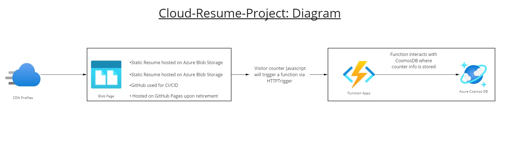

# Cloud-Resume-Project
## *Azure-based full-stack serverless coding project using Blob Storage, Functions, CosmosDB, and GitHub Actions*

## Technologies Used:
- Shell and scripting language: Powershell
- IEM: VS Code
- Frontend: HTML5, CSS, JavaScript
- Backend: C#, .Net, .Net Core 3.1 SDK
- Cloud: Azure, AzureFunction, CosmosDB, Azure CDN

## Challenges
- Adding formatting practices not included in tutorial video
- Adding images to Readme
- Developing sound documentation practices
- Properly triggering AzureFunction

## Diagram 

## Table of Contents 
- [Cloud-Resume-Project](#cloud-resume-project)
  - [*Azure-based full-stack serverless coding project using Blob Storage, Functions, CosmosDB, and GitHub Actions*
](#azure-based-full-stack-serverless-coding-project-using-blob-storage-functions-cosmosdb-and-github-actionshr)
  - [Technologies Used:](#technologies-used)
  - [Challenges](#challenges)
  - [Diagram](#diagram)
  - [Table of Contents](#table-of-contents)
  - [Credits](#credits)
    - [Project References](#project-references)
    - [Frontend](#frontend)
    - [Backend](#backend)
    - [Cloud](#cloud)
    - [Other](#other)
  - [License](#license)

## Credits

### Project References

- <a href="https://github.com/madebygps/cgc-azure-resume">Cloud Guru Azure Resume Challenge.</a>
- <a href="https://www.youtube.com/watch?v=ieYrBWmkfno&t=281s">Cloud Guru Azure Resume Challenge Video</a>
  
### Frontend
- <a href="https://www.geeksforgeeks.org/html-hr-tag/">GeeksforGeeks.org article on adding a horizontal rule</a>

### Backend

### Cloud

- <a href="https://github.com/madebygps/cgc-azure-resume">Cloud Guru Azure Resume Challenge.</a>
  
### Other
  
- <a href="https://github.com/adam-p/markdown-here/wiki/Markdown-Cheatsheet">Markdown Cheatsheet by Adam-P.</a>
  

## License

